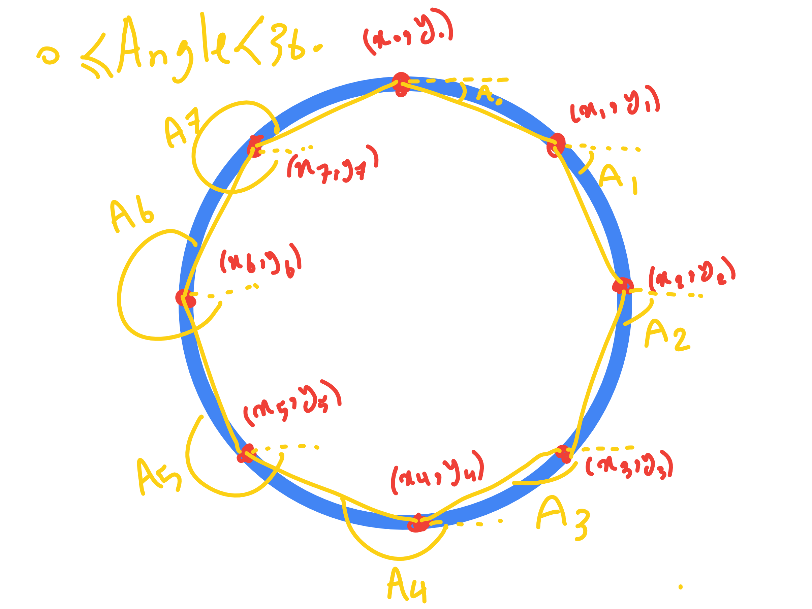
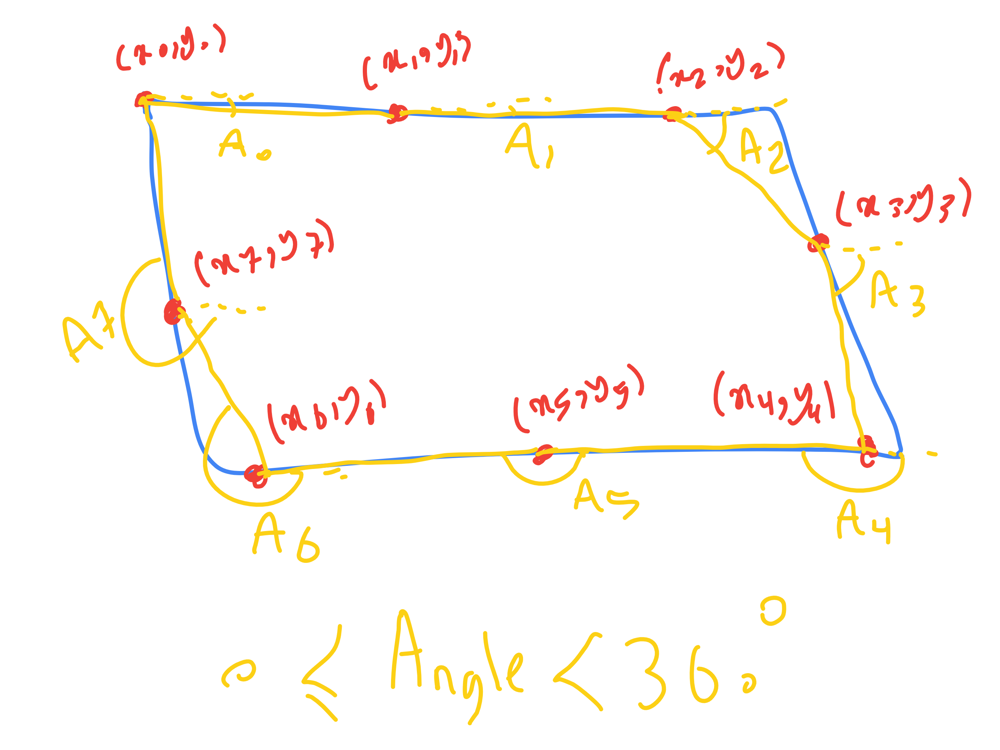
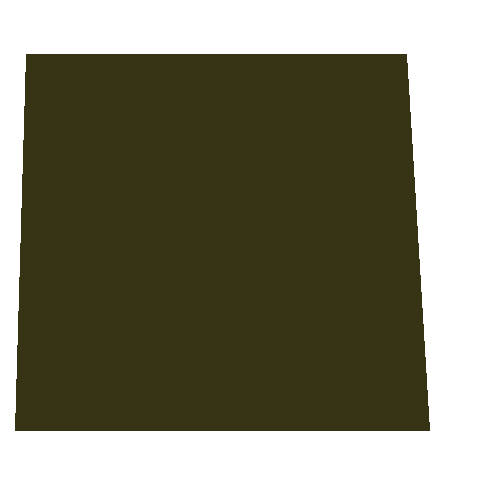
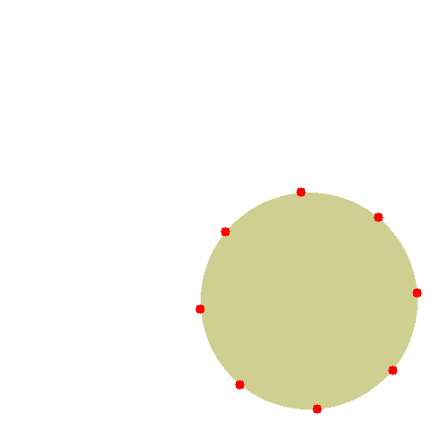
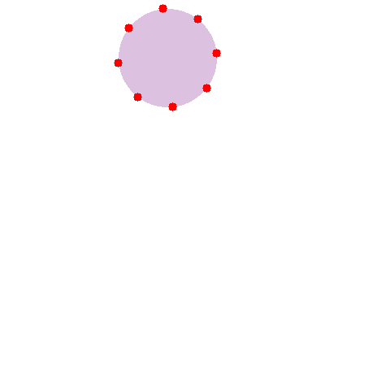
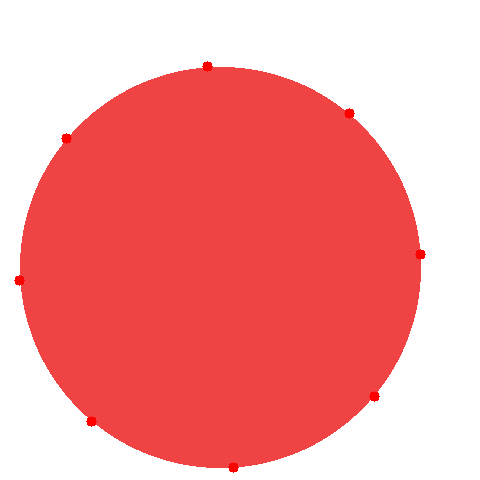
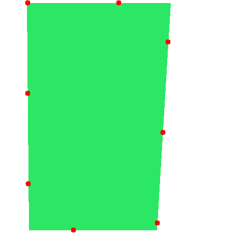
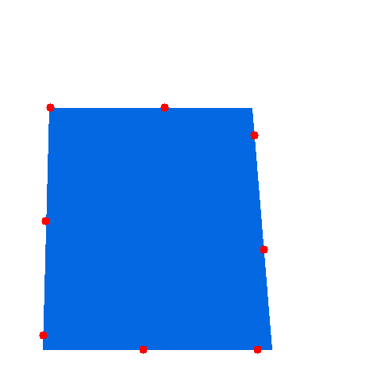
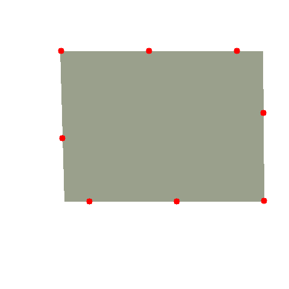

## Object classification using Hidden Markov Model (HMM)

# 
TO classify images to "circle" or "square" we have used Hidden Markov Model algorithm. The HMM classify the an image based on observations from the image. We have modeled the problem as following steps.

- Extracting features from image
   - Convert RGB image to Gray image
   - Finding edges in image using *Canny* edge detector.
   - Finding countour in image
   - Selecting n = n_observations points from all countour points almost equally spaces

- Preprocess features
  For each image we have n = *n_observations* points as (x,y), X = {(x_1, y_1), (x_2, y_2), ... ,(x_n, y_n)}. we calculate the angle for each point regarding the next point as following figure. Then we calculate the angle difference for each adjecent points. 

  <div align="center">
  <kbd style="width: 2px"></kbd>
  <kbd style="width: 2px"></kbd>
  <p align="center"> Figure: Angle calculation for n_observations = 8 observations </p>
  </div> 

  - Calculate angle for each point
     ```math
      $$
      \text{Angle}_i = \text{atan2}(y_{i+1} - y_i, x_{i+1} - x_i) \times \frac{180}{\pi}
      $$
     ```
  - Calculate angle difference for each point as observation
    ```math
    $ \text{Diff_Angle}_i = (Angle_i - Aingle_{i-1}) $
    ```

- Train HMM model 
  - **Calculate Transition matrix:** The transition matrix in an HMM is a square matrix that shows the probability of transitioning from one state to another. In this case, the states would be "circle" and "square". The transition matrix would be calculated by counting the number of times a transition from one state to another occurs in the training data, and then normalizing the counts. Hence we don't have any transition between classes the Transitio matrix will be identity matrix.

  - **Calculate Emision matrix:** The emission matrix in an HMM is a square matrix that shows the probability of emitting an observation from a particular state. In this case, the observations would be the angle differences between adjacent points in the image. The emission matrix would be calculated by counting the number of times each angle difference is emitted from each state in the training data, and then normalizing the counts.

  - **Calculate prior probabilities:** The prior probabilities in an HMM are the probabilities of starting in a particular state. In this case, the prior probabilities would be the probabilities of starting with a circle or a square. The prior probabilities would be calculated by counting the number of times each state occurs in the first observation in the training data, and then normalizing the counts.

Once the transition matrix, emission matrix, and prior probabilities have been calculated, the HMM can be used to classify new images. To do this, the HMM would be applied to the new image, and the state with the highest probability would be the predicted class of the image.


#

### How to use
- Before starting set values in config.yaml file
```yaml
dataset_dir: "./dataset"
imgsz: 480              # dataset image size 480x480
n_train_samples_per_class: 800
n_test_samples_per_class: 200
n_state: 2              # number of classes (circle and square)
n_observations: 5       # number of points on contour of each shape
n_emission: 10          # each 180/10 = 18 degree in each bin
```

- To create circle and square images 
```python
python create_imageas.py
```

Sample images
<div align="center">
  <kbd style="width: 2px"></kbd>
  <kbd style="width: 2px"></kbd>
  <kbd style="width: 2px"></kbd>
</div>

<div align="center">
  <kbd style="width: 2px"></kbd>
  <kbd style="width: 2px"></kbd>
  <kbd style="width: 2px"></kbd>

</div>

- To create dataset in npz format
- This script find n = n_observation points from object countour and create a dataset from points and label for each sample
```python
python create_dataset.py
```

<div align="center">
  <kbd style="width: 2px"></kbd>
  <kbd style="width: 2px"></kbd>
  <kbd style="width: 2px"></kbd>
</div>

<div align="center">
  <kbd style="width: 2px"></kbd>
  <kbd style="width: 2px"></kbd>
  <kbd style="width: 2px"></kbd>
</div>


- To train and test model
```python
python train.py
```


- To predict class of a given image used the saved HMM model
```python
python predict.py
python predict.py -i /path/to/image/
python predict.py -i dataset/test/circle/non_ideal_circle_51.png
```
