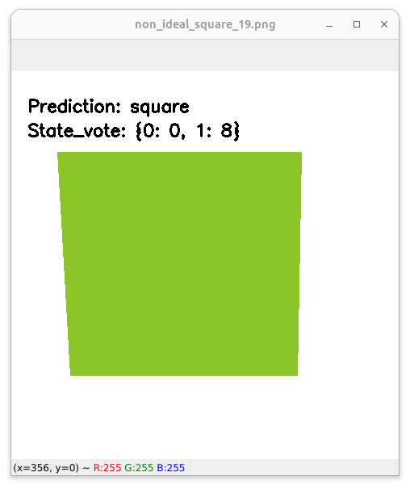
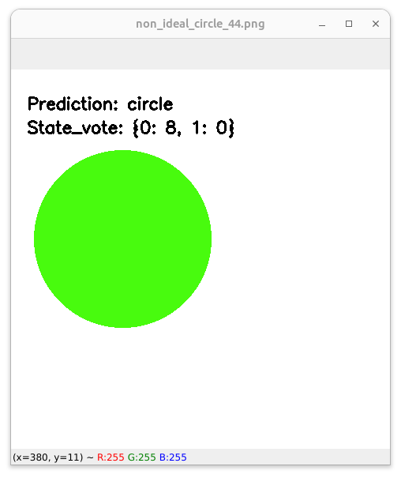

## Object classification using Hidden Markov Model (HMM)

# 
To classify images to "circle" or "square" we have used Hidden Markov Model algorithm. The HMM classify the an image based on observations from the image. We have modeled the problem as following steps.

## Extracting features from image
   - Convert RGB image to Gray image
   - Finding edges in image using *Canny* edge detector.
   - Finding countour in image
   - Selecting n = n_observations points from all countour points almost equally spaces

## Preprocess features
  For each image we have n = *n_observations* points as (x,y), X = {(x_1, y_1), (x_2, y_2), ... ,(x_n, y_n)}. we calculate the angle for each point regarding the next point as following figure. Then we calculate the angle difference for each adjecent points. 

  <div align="center">
  <kbd style="width: 2px"></kbd>
  <kbd style="width: 2px"></kbd>
  <p align="center"> Figure: Angle calculation for n_observations = 8 observations </p>
  </div> 

  - Calculate angle for each point
     ```math
      $$
      \text{Angle}_i = \text{atan2}(y_{i+1} - y_i, x_{i+1} - x_i) \times \frac{180}{\pi}
      $$
     ```
  - Calculate angle difference for each point as observation
    ```math
    $ \text{Diff_Angle}_i = (Angle_i - Aingle_{i-1}) $
    ```

## Train HMM model 
  - **Calculate Transition matrix:** The transition matrix in an HMM is a square matrix that shows the probability of transitioning from one state to another. In this case, the states would be "circle" and "square". The transition matrix would be calculated by counting the number of times a transition from one state to another occurs in the training data, and then normalizing the counts. Hence we don't have any transition between classes the Transitio matrix will be identity matrix.
    ```python
    self.transition = {sA: {sB: 0 for sB in range(n_state)} for sA in range(n_state)}
    for sidx in range(n_state):
       self.transition[sidx][sidx]=1
    ```

  - **Calculate Emision matrix:** The emission matrix in an HMM is a square matrix that shows the probability of emitting an observation from a particular state. In this case, the observations would be the angle differences between adjacent points in the image. The emission matrix would be calculated by counting the number of times each angle difference is emitted from each state in the training data, and then normalizing the counts.
    ```python
     for state_idx in range(self.n_state):
         self.emission[state_idx] = {f"E{ne}":0 for ne in range(n_emission)}
    ```
    ```python
    for sample in samples:
        observations = sample["observations"]
        for ob in observations:
            self.emission[sample['label']][ob] += 1 
    
    for state_idx in range(self.n_state):
        totall = sum(self.emission[state_idx][key] for key in self.emission[state_idx])
        self.emission[state_idx] = {k:v/totall for k,v in self.emission[state_idx].items()}
    ```

  - **Calculate prior probabilities:** The prior probabilities in an HMM are the probabilities of starting in a particular state. In this case, the prior probabilities would be the probabilities of starting with a circle or a square. The prior probabilities would be calculated by counting the number of times each state occurs in the first observation in the training data, and then normalizing the counts.
    ```python
    self.pi = {i:1/n_state for i in range(n_state)}
    ```

Once the transition matrix, emission matrix, and prior probabilities have been calculated, the HMM can be used to classify new images. To do this, the HMM would be applied to the new image, and the state with the highest probability would be the predicted class of the image.


## Predict using trained model

  The Viterbi algorithm is a dynamic programming algorithm that is commonly used with Hidden Markov Models to find the most likely sequence of hidden states given a sequence of observations. In our case, the hidden states are "circle" and "square," and the observations are the angle differences between adjacent points in the image.

  Here's a breakdown of the prediction process using the Viterbi algorithm, based on the code you've provided:

   - Initialization: Initialize the Viterbi trellis with probabilities from the initial state distribution (self.pi in our code) for each state ("circle" and "square").
      ```python
      # Initialize the Viterbi trellis with probabilities from the initial state distribution
      observation_probabilities = {-1: self.pi}
      ```

  - Iteration: Iterate through each observation (angle difference) in the   sequence. For each observation and each state, calculate the probability of being in that state at the current observation step. This is done by considering the probabilities of transitioning from all possible previous states to the current state, multiplied by the emission probability of the current observation given the current state.
    ```python
    # Iterate through each observation (angle difference) in the sequence
    for current_observation_idx, observation in enumerate(observations):
        previous_observation_idx = current_observation_idx - 1
        for current_state_idx in range(self.n_state):
            previous_state_prob = []
            for previous_state_idx in range(self.n_state):
                # Calculate the probability of being in the current state at the current observation step
                prior = observation_probabilities[previous_observation_idx][previous_state_idx]
                trans = self.transition[previous_state_idx][current_state_idx]
                emission = self.emission[current_state_idx][observation]
                prob = prior * trans * emission
                previous_state_prob.append(prob)

            # Update the observation_probabilities trellis with the calculated probabilities
            if current_observation_idx not in observation_probabilities:
                observation_probabilities[current_observation_idx] = {}
            observation_probabilities[current_observation_idx][current_state_idx] = max(previous_state_prob)
    ```

  - Backtracking: After computing probabilities for each state at each observation step, at the end of the sequence, backtrack through the trellis to find the most likely sequence of states that produced the given observations. This is done by selecting the state at each observation step that has the highest probability.

    ```python
    state_vote = {state_idx:0 for state_idx in range(self.n_state)}
    ```

  - Vote Countingand Final Prediction: We are counting the votes for each state over the entire sequence of observations. This can help you determine which state has the most "votes" or support across the sequence. The state that receives the most votes or has the highest overall probability across the sequence is our final predicted state for the input image.
    ```python
      for observation_idx in range(n_observation):
        observation_probabilities_state = observation_probabilities[observation_idx]
        winner_state = max(observation_probabilities_state.items(), key=operator.itemgetter(1))[0]
        state_vote[winner_state] +=
    winner_class = max(observation_probabilities_state.items(), key=operator.itemgetter(1))[0]
    ```

  It's important to note that the Viterbi algorithm finds the most likely sequence of hidden states given the observations, but it doesn't directly provide the class label ("circle" or "square") for an entire image. In our application, we are using the Viterbi algorithm to make a prediction by counting the votes for each state over the sequence of observations.

  It's also worth mentioning that our HMM model assumes that the observations (angle differences) are generated by the hidden states (classes) and that there is a relationship between the observations and the states. Which we are sure our model assumptions align with our problem requirements and data characteristics.

#

### How to use
- Before starting set values in config.yaml file
```yaml
dataset_dir: "./dataset"
imgsz: 480              # dataset image size 480x480
n_train_samples_per_class: 800
n_test_samples_per_class: 200
n_state: 2              # number of classes (circle and square)
n_observations: 5       # number of points on contour of each shape
n_emission: 10          # each 180/10 = 18 degree in each bin
```

- To create circle and square images 
```python
python create_imageas.py
```

Sample images
<div align="center">
  <kbd style="width: 2px"></kbd>
  <kbd style="width: 2px"></kbd>
  <kbd style="width: 2px"></kbd>
</div>

<div align="center">
  <kbd style="width: 2px"></kbd>
  <kbd style="width: 2px"></kbd>
  <kbd style="width: 2px"></kbd>

</div>

- To create dataset in npz format
- This script find n = n_observation points from object countour and create a dataset from points and label for each sample
```python
python create_dataset.py
```

<div align="center">
  <kbd style="width: 2px"></kbd>
  <kbd style="width: 2px"></kbd>
  <kbd style="width: 2px"></kbd>
</div>

<div align="center">
  <kbd style="width: 2px"></kbd>
  <kbd style="width: 2px"></kbd>
  <kbd style="width: 2px"></kbd>
</div>


- To train and test model
```python
python train.py
```


- To predict class of a given image used the saved HMM model
```python
python predict.py
python predict.py -i /path/to/image/
python predict.py -i dataset/test/circle/non_ideal_circle_51.png
```

<div align="center">
  <kbd style="width: 2px"></kbd>
  <kbd style="width: 2px"></kbd>
</div>
