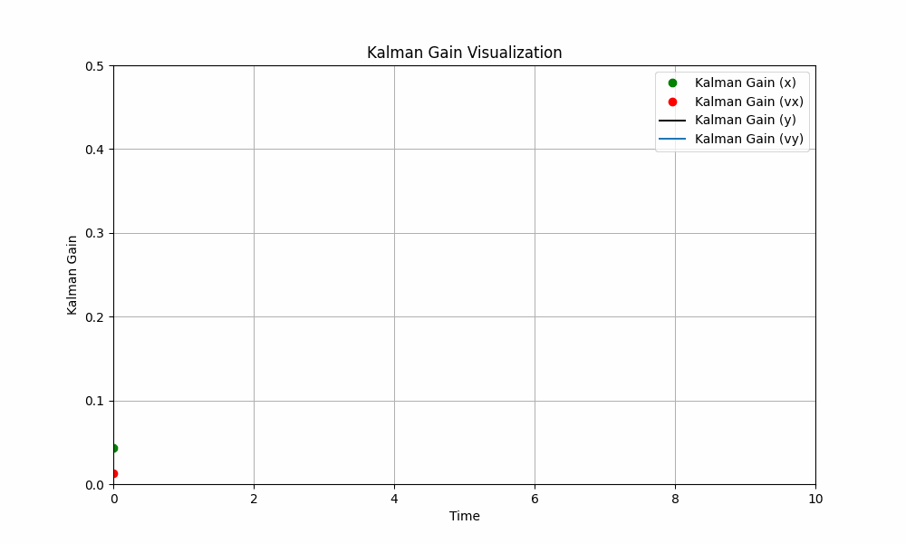

# Kalman Filter for Ball Trajectory Estimation
<div align="center">
  
</div>
 *Figure 1: Comparison of ground truth trajectory, noisy measurements, and filtered estimates from two Kalman filter models. The second filter (kf2) closely follows the ground truth trajectory, demonstrating improved accuracy.*


<div align="center">
  
</div>

*Figure 2: Visualization of Kalman gain values over time for each component (x, vx, y, vy). As the number of filtering steps increases, the Kalman gain values decrease, indicating increased confidence in estimates.*

## Abstract
This report outlines the implementation of a Kalman filter for estimating the trajectory of a ball based on noisy measurements. The project aims to showcase the effectiveness of Kalman filtering in reducing noise and improving trajectory estimation accuracy.

## Introduction
The Kalman filter is a powerful tool used for state estimation in various fields. In this project, we apply the Kalman filter to estimate the trajectory of a ball, emphasizing its significance in accurate position and velocity estimation.

## Methodology

### Kalman Filter Setup
The Kalman filter model is initialized with state variables representing position and velocity in both x and y dimensions. The state transition equations capture the ball's motion, and the measurement equations relate noisy measurements to the true state. Process noise and measurement noise covariance matrices are crucial parameters in the filter setup.
```python
def get_kf(x, dt, noise_std):
    # Kalman filter setup
    kf = KalmanFilter(dim_x=4, dim_z=2)
    kf.x = np.array(x).reshape(4,1)  # Initial state [x, vx, y, vy]
    kf.P *= 1.0  # Covariance matrix
    kf.R = np.diag([noise_std**2, noise_std**2])  # Measurement noise covariance
    kf.Q = np.eye(4) * 0.01  # Process noise covariance

    # x_new  = x + vx * dt             + 0.5*dt*dt * gx 
    # vx_new =     vx                  + dt * gx 
    # y_new  =             y + vy * dt                  + 0.5*dt*dt * gy 
    # vy_new =                 vy                       + dt * gy
    kf.F = np.array([[1, dt,  0,  0],
                     [0,  1,  0,  0],
                     [0,  0,  1, dt],
                     [0,  0,  0,  1]])

    # Mesuring only x and y 
    kf.H = np.array([[1, 0, 0, 0],
                     [0, 0, 1, 0]])
    return kf
```

### Generating Ground Truth Trajectory
We generate the ground truth trajectory of the ball using physics-based equations that consider initial conditions and acceleration due to gravity. This serves as a reference for evaluating the accuracy of the Kalman filter estimates.
```python
# Generating Ground Truth Trajectory
# Constants
gx = 0
gy = -9.8  # Acceleration due to gravity

# Initial conditions
x0 = 0
y0 = 30
v0 = 20  # Initial velocity
alpha = np.radians(60)  # Shooting angle in radians
vx0 = v0 * math.cos(alpha)
vy0 = v0 * math.sin(alpha)

# Time settings
t_start = 0
t_end = 10
n_steps = 30
dt = (t_end - t_start) / n_steps  # Time step
t = np.linspace(t_start, t_end, n_steps)

# Generate ground truth trajectory
x = x0 + vx0 * t + 0.5 * gx * t * t
y = y0 + vy0 * t + 0.5 * gy * t * t
```

### Simulating Noisy Measurements
Random noise is added to the ground truth trajectory to simulate noisy measurements. The noise standard deviation is carefully chosen to mimic real-world conditions and to assess the filter's ability to handle noisy data.
```python
# Simulating Noisy Measurements
# Add random noise to x and y to simulate measurements
np.random.seed(0)  # For reproducibility
noise_std = 5.0
x_obs = x + np.random.normal(0, noise_std, n_steps)
y_obs = y + np.random.normal(0, noise_std, n_steps)
```

### Kalman Filter Implementation
The Kalman filter is implemented with prediction and update phases. Two filter models are utilized: one with traditional prediction and update steps, and the other incorporating acceleration due to gravity. The Kalman gain matrix plays a crucial role in balancing prediction and measurement updates.
```python
# Kalman Filter Implementation
kf1 = get_kf([x0, vx0, y0, vy0], dt, noise_std)
kf2 = get_kf([x0, vx0, y0, vy0], dt, noise_std)

# Perform Kalman filtering
filtered_state_means_1 = []
filtered_state_means_2 = []

u = np.array([[gx], 
                [gy]]).reshape(2,1)

B = np.array([[0.5*dt*dt, 0],
                [dt,        0],
                [0, 0.5*dt*dt],
                [0,        dt]]).reshape(4,2)

# Create a list to store Kalman gain values
kalman_gain_history = []
for obs in zip(x_obs, y_obs):
    kf1.predict()
    kf1.update(obs)
    filtered_state_means_1.append(kf1.x)

    kf2.predict(u=u, B=B)
    kf2.update(obs)
    filtered_state_means_2.append(kf2.x)

    # Append the Kalman gain matrix to the history list
    kalman_gain_history.append(kf2.K)

filtered_state_means_1 = np.array(filtered_state_means_1)
filtered_state_means_2 = np.array(filtered_state_means_2)
```

## Results and Analysis
The figure above presents a comparison of the ground truth trajectory, noisy measurements, and the filtered estimates obtained from two Kalman filter models. The first filter (kf1) represents the basic Kalman filter, while the second filter (kf2) incorporates acceleration due to gravity in its prediction step. As observed, the trajectory estimated by the second filter (kf2) closely follows the ground truth trajectory and demonstrates more accurate estimation.

Visualizing the Kalman gain values over time provides insights into how the filter adapts to changing measurement characteristics. The Kalman gain's responsiveness is a key factor in achieving robust trajectory estimation.

The Kalman gain visualization plot above displays the evolution of the Kalman gain values over time for each component (x, vx, y, vy). It is observed that as the number of filtering steps increases, the Kalman gain values tend to decrease. This behavior signifies that the filter becomes more confident in its estimates over time, resulting in a reduction of the correction applied based on new measurements. This adaptation of the Kalman gain contributes to the filter's ability to strike a balance between predicted and observed values, ultimately leading to improved trajectory estimation.

# Additional Observations and Insights
In addition to the presented results, several other insights can be gleaned from this project:

- Effect of Acceleration: The inclusion of acceleration due to gravity in the filter's prediction step (kf2) yields more accurate trajectory estimates, showcasing the importance of incorporating physical laws into the estimation process.

- Filter Convergence: The convergence of the Kalman gain values implies that the filter reaches a stable state where it is effectively minimizing the error between predicted and observed measurements.

- Noise Handling: The noise reduction observed in the filtered estimates demonstrates the Kalman filter's ability to effectively handle noisy measurements and produce smoother trajectories.


### Trajectory Estimation
A comparison between the ground truth trajectory and noisy measurements illustrates the challenge of accurate estimation. The filtered trajectory estimates from both models show significant noise reduction and improved accuracy.
```python
# Plotting the results
plt.figure(figsize=(10, 6))

# Plot Ground Truth
plt.plot(x, y, label='Ground Truth', color='black')

# Plot Noisy Measurements
plt.plot(x_obs, y_obs, label='Noisy Measurements', marker='o', linestyle='None', color='red')

# Plot Filtered Estimate 1
plt.plot(filtered_state_means_1[:, 0], filtered_state_means_1[:, 2], label='Filtered Estimate 1', marker='o', color='green')

# Plot Filtered Estimate 2
plt.plot(filtered_state_means_2[:, 0], filtered_state_means_2[:, 2], label='Filtered Estimate 2', marker='o', color='blue')

# Add labels and legend
plt.legend()
plt.title('Kalman Filter for Ball Trajectory Estimation with Noisy Observations')
plt.xlabel('X')
plt.ylabel('Y')
plt.grid(True)
plt.show()
```

### Kalman Gain Visualization
Visualizing the Kalman gain values over time provides insights into how the filter adapts to changing measurement characteristics. The Kalman gain's responsiveness is a key factor in achieving robust trajectory estimation.
```python
# Plotting the Kalman gain values for each component (x and y)
plt.figure(figsize=(10, 6))
plt.plot(t, kalman_gain_history[:, 0, 0], label='Kalman Gain (x)', marker='o', color='green', linestyle='None')
plt.plot(t, kalman_gain_history[:, 1, 0], label='Kalman Gain (vx)', marker='o', color='red', linestyle='None')
plt.plot(t, kalman_gain_history[:, 2, 1], label='Kalman Gain (y)', color='black')
plt.plot(t, kalman_gain_history[:, 3, 1], label='Kalman Gain (vy)')

# Add labels and legend
plt.legend()
plt.title('Kalman Gain Visualization')
plt.xlabel('Time')
plt.ylabel('Kalman Gain')
plt.grid(True)
plt.show()
```

### Advantages of Kalman Filtering
The project highlights the benefits of Kalman filtering in trajectory estimation. It showcases noise reduction capabilities, making it suitable for real-world scenarios where measurements are prone to noise.

## Conclusion
The successful implementation of the Kalman filter for ball trajectory estimation underscores its importance in accurate state estimation. This project demonstrates the filter's potential to enhance the reliability of trajectory estimation tasks.
