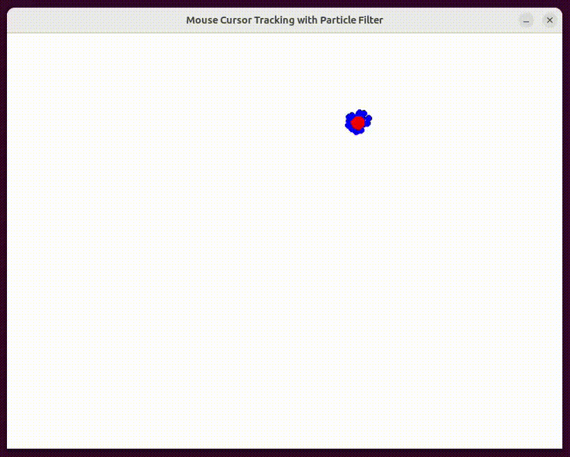

# Mouse Cursor Tracking with Particle Filter

This repository contains a Python script using the Pygame library to implement a simple particle filter for tracking the mouse cursor.

<div align="center">
  
</div>


## Repository Structure

- The `Particle_Filter` folder contains the main Python script:
  - [`particle_filter_mouse_tracking.py`](particle_filter_mouse_tracking.py)

## Features

- Particle filter implementation in Python using Pygame.
- Predicts particle positions with random Gaussian noise.
- Updates particle weights based on the distance to the mouse cursor.
- Resamples particles based on their weights.

## Getting Started

### Prerequisites

- Python 3.x
- Pygame library (`pip install pygame`)

### Running the Code

1. Clone the repository:

    ```bash
    git clone https://github.com/majnas/Machine_Learning_With_Code.git
    ```

2. Navigate to the project directory:

    ```bash
    cd Machine_Learning_With_Code/Particle_Filter
    ```

3. Run the Python script:

    ```bash
    python particle_filter_mouse_tracking.py
    ```

## Usage

- The script initializes a swarm of particles, predicts their positions, and updates their weights based on the mouse cursor's distance.
- The particles are displayed on the Pygame window, and their movement is influenced by the mouse cursor.
- Press `ESC` or close the window to exit the program.

## Customization

Feel free to customize the script based on your requirements. You can adjust parameters like the number of particles, particle radius, display width, and display height in the code.

## Acknowledgments

- Inspired by particle filter concepts in robotics and computer vision.
