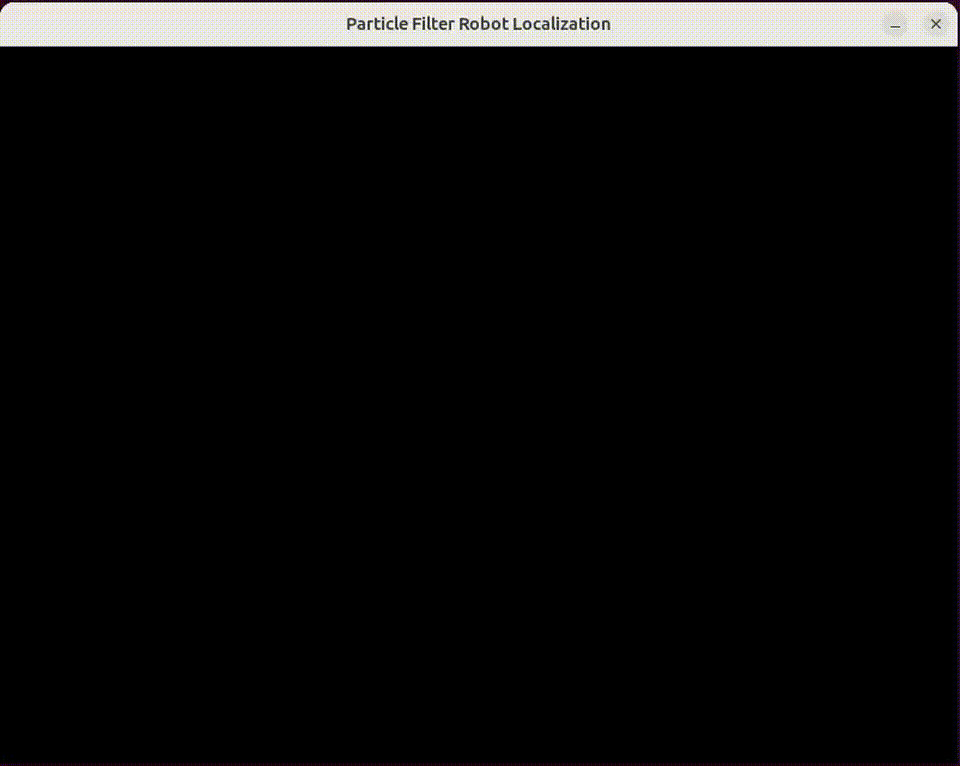
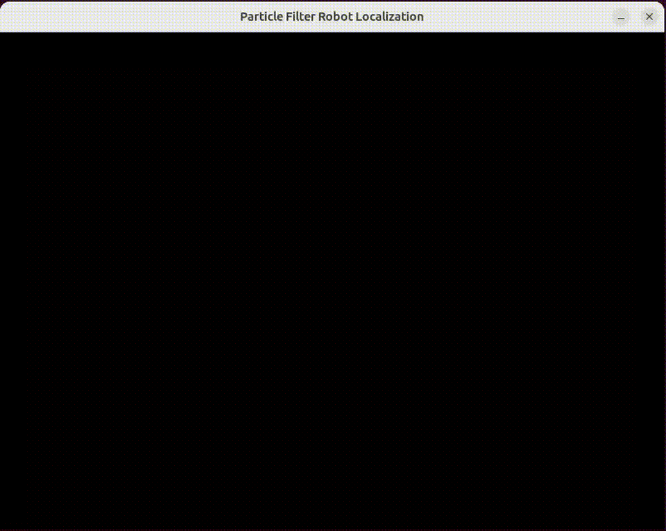

# Mouse Cursor Tracking with Particle Filter

This repository contains a Python script using the Pygame library to implement a simple particle filter for tracking the mouse cursor.

<div align="center">
  
</div>

# More samples
<table style="width:100%">
  <tr>
    <td style="text-align:center; padding: 5px;">
      
    </td>
    <td style="text-align:center; padding: 5px;">
      
    </td>
  </tr>
  <tr>
    <td style="text-align:center; padding: 5px;">
      
    </td>
    <td style="text-align:center; padding: 5px;">
      
    </td>
  </tr>
</table>


# Particle Filter Robot Localization

This project implements particle filter-based localization for a robot on a board environment. It utilizes pygame for visualization and provides functionality to localize a robot using particle filtering.

## Repository Structure

The repository consists of the following files:

- `board.py`: Contains the `Board` class representing the game board and the `Sensors` class for sensor readings.
- `particle.py`: Includes the `Particle` class representing particles in the particle filter, the `Robot` class for the robot, and the `Resampling` class for the resampling step in the particle filter.
- `particle_filter_robot_localization.py`: The main script implementing the particle filter localization algorithm and visualization using pygame.

## Features
- Particle filter-based robot localization.
- Visualization using pygame.
- Dynamic resampling of particles.
- Robot movement and sensor readings.

### Prerequisites

- Python 3.x
- Pygame

### Running the Code

1 . Install the required dependencies:
```bash
pip install pygame numpy
```

2. Clone the repository:
```bash
git clone https://github.com/majnas/Machine_Learning_With_Code
cd Machine_Learning_With_Code/Particle_Filter/particle_filter_robot_localization
```

3. Run the main script:
```bash
python particle_filter_robot_localization.py
```
or 
```bash
python particle_filter_robot_localization.py --board_width 1200 --board_height 800 --cell_size 20 --num_particles 1000
```

## Usage
The program will open a window displaying the game board and the robot's movement.
The robot will attempt to localize itself within the board environment using particle filtering.
You can pause/resume the simulation by pressing the space bar whe the `--step_by_keyboard` key is active.
Press Q to quit the simulation.

## Customization
You can customize various parameters such as board size, number of particles, robot speed, and sensor limit by modifying the command-line arguments in the main script or directly in the script itself.

## Acknowledgments
This project is inspired by the implementation provided by Lei Mao in the [Particle-Filter](https://github.com/leimao/Particle-Filter) repository.
Credits to the authors and contributors of pygame for providing a powerful library for game development and visualization.