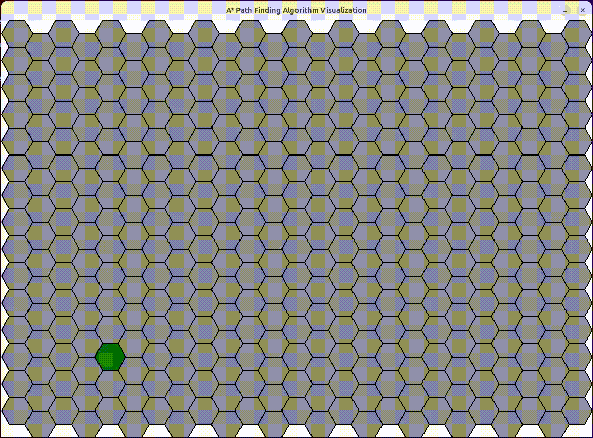

# A* Pathfinding Algorithm Visualization
This project implements the A* pathfinding algorithm to find the shortest path from a start cell to an end cell on either a square or hexagonal board. The visualization is done using the Pygame library.

## Visualization of A algorithm on a hexagonal grid.*
<div align="center">
  
</div>

## Visualization of A algorithm on a square grid.*
<div align="center">
  
</div>


### Features
A Algorithm*: Implements the A* algorithm for pathfinding.
Hexagonal and Square Grids: Supports both hexagonal and square grid visualizations.
Interactive GUI: Allows users to set start points, barriers, and visualize the pathfinding process interactively.
Random End Point: Automatically sets a random end point for the pathfinding.

### Dependencies
- Python 3.x
- Pygame
- Shapely (for hexagonal grid calculations)

Install dependencies using pip:
```sh
pip install pygame shapely
or 
pip install -r rerequirements.txt
```

### Usage
Run the main script with the following command:
```sh
python main.py [shape] [--rows ROWS] [--cols COLS] [--length LENGTH]
```

### Arguments
shape: Choose between 'square' or 'hex' (default: 'hex')
    --rows, -r: Number of rows (default: 15)
    --cols, -c: Number of columns (default: 25)
    --length, -l: Length of each cell in the board (default: 30)

### Example
```sh
python main.py hex -r 10 -c 20 -l 30
python main.py square -r 10 -c 20 -l 30
```

### Controls
- Left Click: Set the start point or barriers on the grid.
- Right Click: Reset a cell.
- Spacebar: Start the pathfinding algorithm.
- C Key: Clear the grid.
- Q or ESC: Quit the application.

### Project Structure
- main.py: The main script to run the application.
- a_star.py: Contains the implementation of the A* algorithm.
- board.py: Abstract base class for the board.
- hex.py: Implements the hexagonal grid and node.
- square.py: Implements the square grid and node.
Visual Demonstration

## Colors in Visualization
- White: Unvisited cells.
- Black: Barrier cells that the path cannot cross.
- Orange: The start cell.
- Green: The end cell.
- Blue: Cells that are in the open set, meaning they are being considered for the path.
- Gold: Cells that have been visited and are in the closed set.
- Red: Cells that form the final path from the start cell to the end cell.

## Contributing
Feel free to open issues or submit pull requests if you find any bugs or have suggestions for improvements.