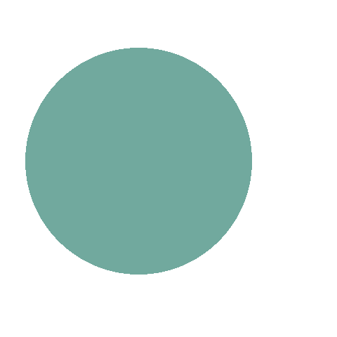

## Object classification using Hidden Markov Model (HMM)

### How to use
- Before starting set values in config.yaml file
```
dataset_dir: "./dataset"
imgsz: 480              # dataset image size 480x480
n_train_samples_per_class: 800
n_test_samples_per_class: 200
n_state: 2              # number of classes (circle and square)
n_observations: 5       # number of points on contour of each shape
n_emission: 10          # each 180/10 = 18 degree in each bin
```

- To create circle and square images 
```python
python create_imageas.py
```

Sample images
<div align="center">
  
  
  
</div>

<div align="center">
  
  
  
</div>

- To create dataset in npz format
```python
python create_dataset.py
```

- To train and test model
```python
python train.py
```

