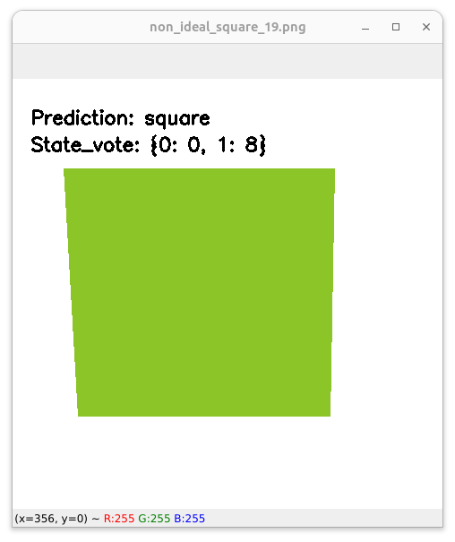
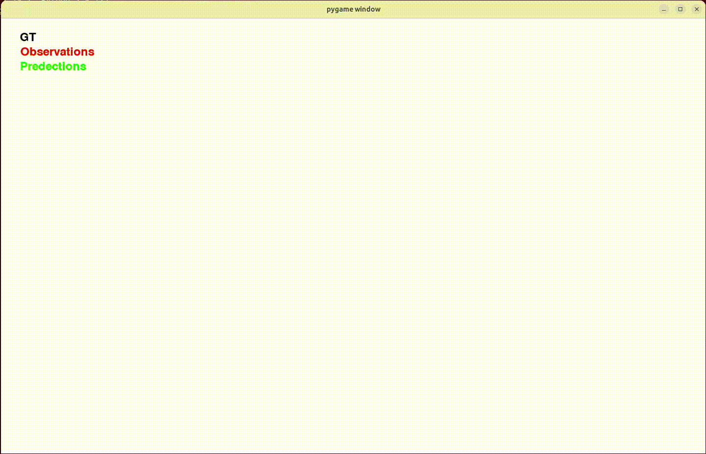

# Machine_Learning_With_Code
Basic Machine Learning Algorithms With Code

- [x] [Hidden Markov Model](https://github.com/majnas/Machine_Learning_With_Code/tree/master/Hidden_Markov_Model)
- [x] [Kalman-Filter](https://github.com/majnas/Machine_Learning_With_Code/tree/master/Kalamn_Filter)
- [ ] [Extended Kalman-Filter]()
- [x] [Particle Filtering](https://github.com/majnas/Machine_Learning_With_Code/tree/master/Particle_Filter)
- [ ] [Principal Component Analysis]()
- [ ] [Independent Component Analysis]()
- [ ] [Genetic Algorithm]()

# Hidden_Markov_Model

  <kbd style="width: 2px"></kbd>
  <kbd style="width: 2px"></kbd>

# Kalamn_Filter
## Kalman Filter for Ball Trajectory Estimation

  

## Kalman Filter for Ball Trajectory Estimation Game

  

# Particle_Filter
## Mouse Cursor Tracking with Particle Filter

  

## Particle Filter Robot Localization

  

<table style="width:100%">
  <tr>
    <td style="text-align:center; padding: 5px;">
      
    </td>
    <td style="text-align:center; padding: 5px;">
      
    </td>
  </tr>
  <tr>
    <td style="text-align:center; padding: 5px;">
      
    </td>
    <td style="text-align:center; padding: 5px;">
      
    </td>
  </tr>
</table>
